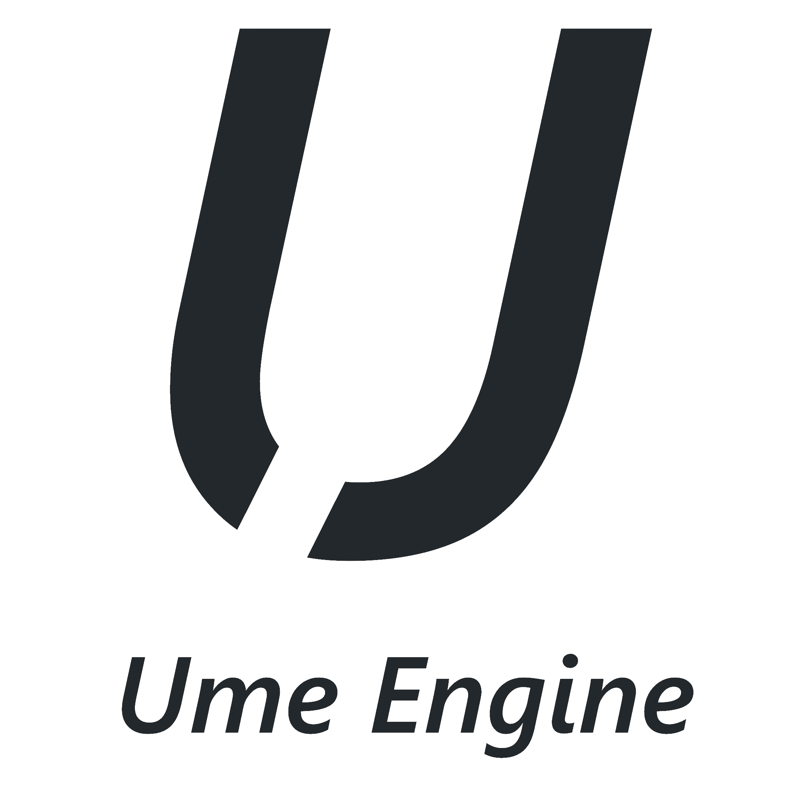

# Ume

> Just a simple 2D game engine build with opengl.

***

## Getting Started

Visual Studio 2022 or newer. For now is just on windows platform. 

<ins>**1. Downloading the repository:**</ins>

Start by cloning the repository with `https://github.com/TheShadowtf/Ume`.

<ins>**2. Configuring the dependencies:**</ins>

1. Add all the submodules using `git submodule add` command. Example: `git submodule add https://github.com/TheCherno/GLFW/tree/d516e6680183bed7096c8fb58c31365deb2cc9b7`. The submodules will be in `Ume/vendor/`
2. You need to download `premake` and put it in `vendor/bin/premake/` or anywhere else but you have to modify the path in the [Win-GenProj.bat](https://github.com/TheShadowtf/Ume/blob/dev/scripts/Win-GenProj.bat) found in `scripts` folder.
3. To create the visual studio projects just run the `Win-GenProj.bat` found in the `scripts` folder.

***

## About

This is a game engine build for me ot understand and learn more about programing and also to create a game engine to be easy for me to create games with it.

### Main features

- 2D rendering (I want it to be mainly for 2D games)
- Suport for 3D games (More like unity)
- Be verry simple to create any game, especially without creating scripts. Won't have a visual programing stile, it will suport C# codding but I want it to have game components for almost everything (different cameras, world generation, player movement, etc.)
- A simple game editor (hopefully :))
- Support for multiple platforms like windows, linux, mac, etc.
- Native rendering API support for OpenGL, Vulkan, DirectX, Metal (Again, hopefully :))
- Native multiplayer suport (Hopefully using steam API but also creating my own multiplayer API if it's a correct term :))
- A good documentation with a lot of examples

## Why?

I want to create this game engine because I don't really like Unity for some things and Unreal Engine because it does not have 2D support so I create my own game engine :)
Will it be good? I hope so.
If I will realase it, will it cost money? No, I want it to be free, maybe just make a patreon if you want to support and help me :)
When will it be done? Idk, I'm too lazy to work on it :)